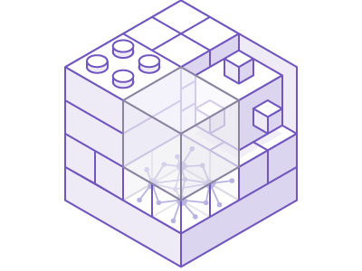
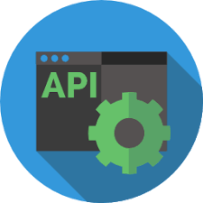
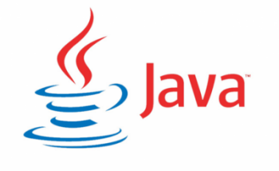
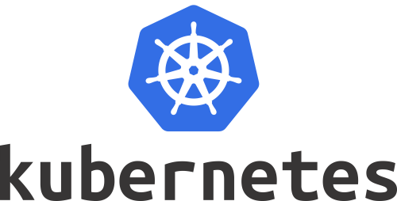
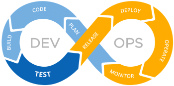

# Технологии разработки программного обеспечения

* [Подготовительный курс. Теоретический минимум по Computer Science](Teoreticheskiy_minimum_po_Computer_Science.pdf)

* [Введение. Презентация](ТРПО.pptx)

* [Scrum](https://www.youtube.com/watch?v=mockcEwNBbs)

* [Жизненный цикл разработки ПО](https://www.youtube.com/watch?v=qg1GF7gsSNo)

* [Чистый код](https://www.youtube.com/watch?v=XT6XkIJIVbA)

* [Принципы SOLID](https://www.youtube.com/watch?v=A6wEkG4B38E)

* [Материалы для самостоятельного изучения](trpo_lections.pdf)

## Архитектура приложений

* [Руководство Microsoft по проектированию архитектуры приложений](MS_Arch_Manual.pdf)

* [Клиент-серверная архитектура в картинках](https://habr.com/ru/post/495698/)

* [Микросервисная VS Монолитная архитектура. Часть 1](https://habr.com/ru/company/simbirsoft/blog/453932/)

* [Микросервисная VS Монолитная архитектура. Часть 2](https://proglib.io/p/monolitnaya-vs-mikroservisnaya-arhitektura-2019-09-16)

* [RAID](https://ru.wikipedia.org/wiki/RAID)

* [RAID. Видео](https://www.youtube.com/watch?v=7pU3edBVcYw)

* [Многоуровневая архитектура](https://ru.wikipedia.org/wiki/%D0%9C%D0%BD%D0%BE%D0%B3%D0%BE%D1%83%D1%80%D0%BE%D0%B2%D0%BD%D0%B5%D0%B2%D0%B0%D1%8F_%D0%B0%D1%80%D1%85%D0%B8%D1%82%D0%B5%D0%BA%D1%82%D1%83%D1%80%D0%B0)

* [Model-View-Controller](https://ru.wikipedia.org/wiki/%D0%9C%D0%BD%D0%BE%D0%B3%D0%BE%D1%83%D1%80%D0%BE%D0%B2%D0%BD%D0%B5%D0%B2%D0%B0%D1%8F_%D0%B0%D1%80%D1%85%D0%B8%D1%82%D0%B5%D0%BA%D1%82%D1%83%D1%80%D0%B0)

* [Архитектура веба: основы для начинающих разработчиков](https://tproger.ru/translations/web-architecture-101/)

* [Балансировка нагрузки: основные алгоритмы и методы](https://habr.com/ru/company/selectel/blog/250201/)

## Docker

* [Docker. Презентация](Docker.pptx)

* [Официальный сайт Docker](https://www.docker.com/)

* [Docker Hub](https://hub.docker.com)

* [Самый простой, полный и понятный туториал Docker для новичков](https://badcode.ru/docker-tutorial-dlia-novichkov-rassmatrivaiem-docker-tak-iesli-by-on-byl-ighrovoi-pristavkoi/)

* Цикл статей по Docker:

* [Часть 1: основы](https://habr.com/post/438796/)

* [Часть 2: термины и концепции](https://habr.com/post/439978/)

* [Часть 3: файлы Dockerfile](https://habr.com/post/439980/)

* [Часть 4: уменьшение размеров образов и ускорение их сборки](https://habr.com/post/440658/)

* [Часть 5: команды](https://habr.com/post/440660/)

* [Часть 6: работа с данными](https://habr.com/post/441574/)

## XML, JSON, API, REST, SOAP

[JSON vs XML. Сравнение технологий и области применения](https://itgap.ru/post/json-vs-xml-sravnenie-tekhnologij-i-oblasti-primeneniya)

[Что такое XML и JSON. Их особенности](https://pointschool.ru/chto-takoe-xml-i-json-ih-osobennosti/)

[XML-технологии](http://www.duct-tape-architect.ru/?p=315)

[Что такое API?](https://habr.com/ru/post/464261/)

[API видео](https://www.youtube.com/watch?v=QYg5z6EGOk4)

[API Wikipedia](https://ru.wikipedia.org/wiki/API)

[Web-сервисы и API](https://www.youtube.com/watch?v=QrISH_hUDtg)

[REST и SOAP](https://www.intervolga.ru/blog/projects/relsy-veb-integratsii-rest-i-soap/)

[REST, RESTful web service, API, SOAP… what’s the difference?](https://medium.com/@wkrzywiec/rest-restful-web-service-api-soap-whats-the-difference-4f101953d0bd)

[REST API](https://www.youtube.com/watch?v=7mbNStvpad0)

## Разработка веб-приложения на Spring Boot (Java)

* [OpenJDK 8](https://adoptopenjdk.net/?variant=openjdk8&jvmVariant=hotspot)

* [IntelliJ JetBrains IDEA Ultimate Edition (30 day trial)](https://www.jetbrains.com/ru-ru/idea/download)

* [Курс Java Core от Алексея Владыкина](https://stepik.org/course/187/promo)

* [Создание простого веб-приложения без БД и деления на слои](https://www.youtube.com/watch?v=jH17YkBTpI4)

* [Spring Boot веб-приложение с нуля](https://java-master.com/spring-boot-%D0%B2%D0%B5%D0%B1-%D0%BF%D1%80%D0%B8%D0%BB%D0%BE%D0%B6%D0%B5%D0%BD%D0%B8%D0%B5-%D1%81-%D0%BD%D1%83%D0%BB%D1%8F/)

## Экскурс в сетевые технологии

* [IP адрес](https://www.youtube.com/watch?v=6tFGoiok0u8)

* [Маршрутизатор, коммутатор и хаб](https://www.youtube.com/watch?v=Bwg-om5NnmQ)

* [VPN](https://www.youtube.com/watch?v=TNJxATppH4E)

* [Модель OSI за 7 минут](https://www.youtube.com/watch?v=je0QFU7p5Oo)

* [TCP и UDP](https://www.youtube.com/watch?v=yMSJKBQINAc&t=19s)

* [Виды сетевых атак](https://www.youtube.com/watch?v=T_iycKFPGEM)

* [LAN и WAN](https://www.youtube.com/watch?v=z6ppjg6xAbQ)

* [DNS сервер](https://www.youtube.com/watch?v=t2NMbSarXC4&t=124s)

* [DHCP](https://www.youtube.com/watch?v=XPRYaGCkXJ8)

* [Ethernet](https://www.youtube.com/watch?v=jLGadArowCE)

## Kubernetes

* [Что такое Kubernetes?](https://kubernetes.io/ru/docs/concepts/overview/what-is-kubernetes/)

* [Компоненты Kubernetes](https://kubernetes.io/ru/docs/concepts/overview/components/)

* [Изучение подов и узлов](https://kubernetes.io/ru/docs/tutorials/kubernetes-basics/explore/explore-intro/)

* [Kubectl](https://kubernetes.io/ru/docs/reference/kubectl/overview/)

* [Знакомство с Kubernetes](https://rtfm.co.ua/kubernetes-znakomstvo-chast-1-arxitektura-i-osnovnye-komponenty-obzor/)

## Контроль версий и командная разработка

* [Git и командная разработка ](https://habr.com/ru/post/440816/)

* [Знакомство с Git и GitHub: руководство для начинающих](https://medium.com/nuances-of-programming/%D0%B7%D0%BD%D0%B0%D0%BA%D0%BE%D0%BC%D1%81%D1%82%D0%B2%D0%BE-%D1%81-git-%D0%B8-github-%D1%80%D1%83%D0%BA%D0%BE%D0%B2%D0%BE%D0%B4%D1%81%D1%82%D0%B2%D0%BE-%D0%B4%D0%BB%D1%8F-%D0%BD%D0%B0%D1%87%D0%B8%D0%BD%D0%B0%D1%8E%D1%89%D0%B8%D1%85-54ea2567d76c)

* [Git на практике](https://habr.com/ru/post/342116/)

* [Git: советы новичкам](https://habr.com/ru/company/playrix/blog/345732/)

* [Как написать красивый и информативный README.md](https://nuancesprog.ru/p/7105/)

* [Разметка README.md в GitHub](http://coddism.com/zametki/razmetka_readmemd_v_github)

## CI/CD и DevOps-практики

* [CI/CD](https://www.youtube.com/watch?v=7S1ndRRht6M)

* [Непрерывная интеграция: CircleCI vs Travis CI vs Jenkins](https://habr.com/ru/company/southbridge/blog/332836/)

* [Что такое Travis CI?](https://habr.com/ru/post/140344/)

* [Travis CI](https://travis-ci.org/)

* [Heroku vs Kubernetes](https://www.fairwinds.com/blog/heroku-vs.-kubernetes-the-big-differences-you-should-know)

* [Heroku](https://www.heroku.com/)

* [Heroku + Docker + Spring Boot](https://habr.com/ru/post/459472/)

* [Deploy Springboot application with Travis and Heroku](https://medium.com/weekly-webtips/your-next-dockerized-spring-boot-application-with-travis-and-heroku-83800b3a3ad8)

* [CI/CD for SpringBoot applications using Travis-CI](https://www.javacodegeeks.com/2018/01/ci-cd-springboot-applications-using-travis-ci.html)

## Дополнительные курсы

* [Java Rush](https://javarush.ru)

* [Slurm: Docker + Kubernetes](https://slurm.io/online)

## Лабораторные работы

* [Лабораторная работа №1: создание микросервиса на Spring Boot с базой данных](MicroService.md)

* [Лабораторная работа №2: создание кластера Kubernetes и деплой приложения](Kubernetes.md)

* [Лабораторная работа №3: CI/CD и деплой приложения в Heroku]()

## Форма приема зачета

Этап 1. Ответы вопросы. Если этап не пройден, то прием зачета прекращается - отправка на пересдачу в следующую сессию.

Этап 2. Написание REST API и деплой в production. Если этап не пройден, то прием зачета прекращается - отправка на пересдачу в следующую сессию.

